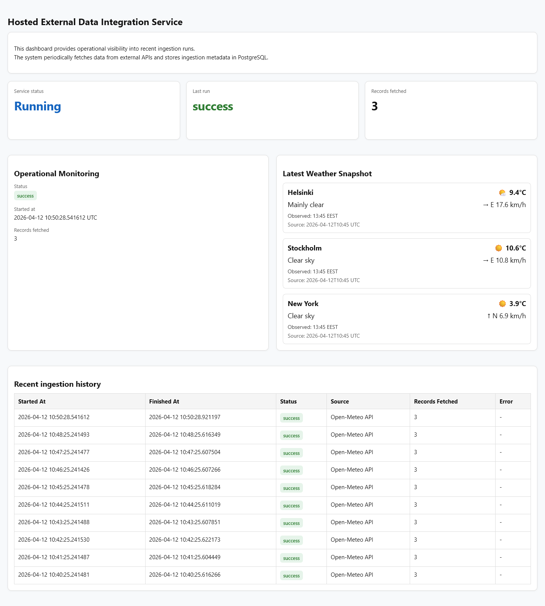
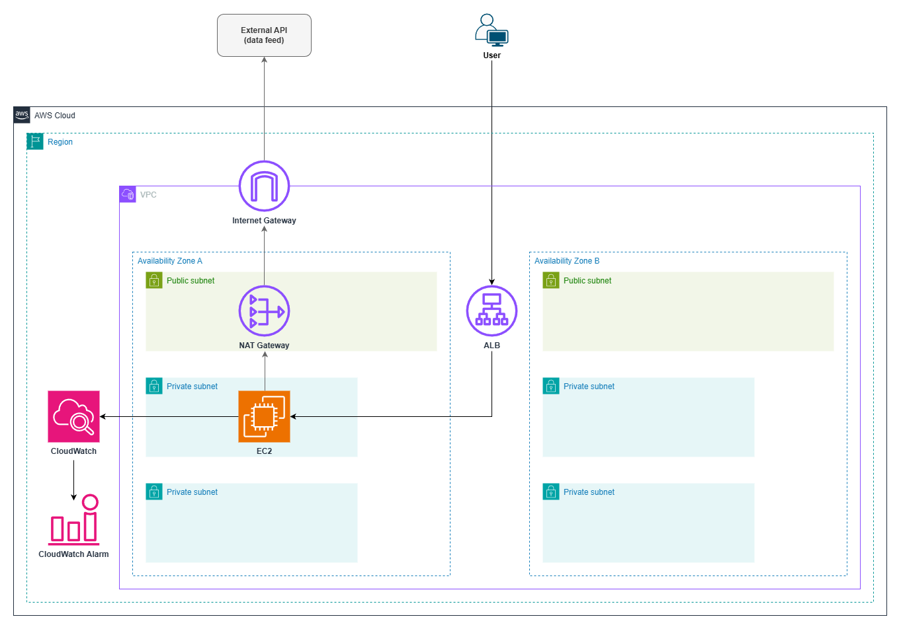
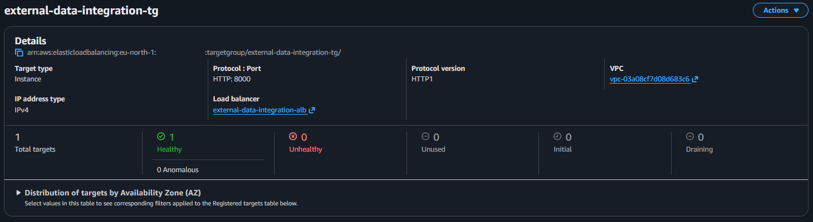
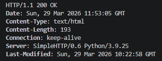

# Hosted External Data Integration Service (AWS)

### Status: MVP working — production-style AWS service deployed

- ALB routing to private EC2 working
- FastAPI service deployed via artifact-based deployment
- Scheduler running background ingestion
- External API ingestion working
- Data stored in RDS PostgreSQL
- Operational dashboard implemented
- Private VPC architecture with NAT egress
- Infrastructure deployed via Terraform
- CI/CD artifact upload via GitHub Actions
- CloudWatch logging enabled
- Alarm notifications tested

### Next Iterations

- Expand architecture to multi-AZ high availability  
- Finalize documentation  

---

## Goal

Fetch → store → monitor → visualize external operational data in a production-style AWS environment.

This project demonstrates a realistic cloud service pattern commonly used for:

- Third-party API integrations  
- Operational data ingestion  
- Scheduled background data collection  
- Internal dashboards and reporting services  

The focus is on **clean architecture, networking fundamentals, automation, and observability**, not on building a full product.

---

## Dashboard Overview

Production-style operational dashboard providing real-time visibility into:

- Service status and latest ingestion result  
- Background ingestion activity  
- Latest external data snapshot  
- Historical ingestion runs  

Designed to simulate internal tooling used for monitoring continuously running cloud services.

---

## Architecture Overview

### Flow

1. User accesses the dashboard via HTTPS through the Application Load Balancer (ALB)
2. ALB routes traffic to a FastAPI application running on a private EC2 instance
3. The application scheduler periodically fetches data from an external API via NAT Gateway
4. Application stores historical data in Amazon RDS PostgreSQL
5. Amazon CloudWatch collects logs and operational metrics
6. CloudWatch alarms notify on unhealthy backend targets and high CPU usage

In this project, a public API (such as weather data) is used only to simulate a continuous external data stream.  
The weather data itself is not the goal of the system.

The purpose is to demonstrate a realistic external API integration pattern where a service periodically ingests data from third-party providers, stores historical records, and exposes operational visibility.

The same architecture could be used for:

- Partner integrations  
- Price monitoring  
- Operational metrics collection  
- IoT data ingestion  
- Analytics feeds  
- Business reporting pipelines  

---

## Problem Statement

Build a continuously running service that securely ingests external third-party data, stores historical records, and exposes that data through a dashboard — without placing the application server directly on the public internet.

This mirrors real-world systems where:

- External APIs must be polled periodically  
- Services must run continuously  
- Application servers should not be public  
- Data must be stored and queried later  
- Operational visibility is required  

---

## First Principles Breakdown

### What is the simplest system that solves the problem?

1. **Secure public entry point**  
Users need an HTTPS endpoint to access the dashboard.

2. **Always-on compute**  
The service must run continuously to both serve UI and ingest data.

3. **Controlled outbound internet access**  
The application must call external APIs securely.

4. **Persistent storage**  
Historical data must be stored for reporting and visualization.

5. **Operational visibility**  
Logs and alarms are required for debugging and monitoring.

---

## Business Context

Many systems need to periodically collect data from external providers:

- Weather APIs  
- Partner systems  
- Pricing feeds  
- Traffic data  
- Monitoring endpoints  
- Analytics services  

These systems typically require:

- Scheduled ingestion  
- Persistent storage  
- Internal dashboard  
- Controlled networking  
- Observability  

This project models a **hosted external data integration service** that solves these requirements.

---

## Cost and Scaling Model

- Always-on EC2 compute (chosen instead of serverless to model continuously running integration services)  
- Predictable baseline cost  
- Suitable for continuous ingestion services  
- Scales vertically or via multi-AZ expansion  
- Can later add Auto Scaling  

This architecture trades **higher baseline cost** for **more realistic hosted service design**.

---

## Design Decisions & Trade-offs

### Application Load Balancer instead of public EC2

Pros:
- Application server not exposed to internet  
- Ready for multi-AZ expansion  
- Realistic production pattern  

Trade-off:
- Adds infrastructure complexity

---

### Private EC2 instance

Pros:
- No public IP  
- Controlled inbound access  
- Secure architecture  

Trade-off:
- Requires NAT Gateway for outbound access

---

### NAT Gateway for outbound API access

Pros:
- Private EC2 can call external APIs  
- Keeps application tier private  

Trade-off:
- Adds recurring cost

---

### RDS PostgreSQL for storage

Pros:
- Structured relational data  
- Historical records  
- Realistic service backend  

Trade-off:
- More complex than simple storage

---

### Multi-AZ network with single-instance MVP

Pros:
- Realistic production VPC layout  
- Future-ready for high availability  
- Faster MVP implementation  

Trade-off:
- Application tier not highly available yet

---

## Infrastructure as Code

All infrastructure is defined using **Terraform**.

Current MVP infrastructure:

- VPC  
- Public subnets (multi-AZ)  
- Private application subnets (multi-AZ)  
- Internet Gateway  
- NAT Gateway  
- Route tables  
- Application Load Balancer  
- Private EC2 instance  
- Security groups  
- CloudWatch alarms
- SNS email notifications

Planned next:

- Multi-AZ application tier

Principles:

- Reproducible deployments  
- Least-privilege IAM  
- Clear network boundaries  
- CI/CD deployment workflow  

---

## CI/CD & Infrastructure Automation

This project is designed to be deployed via GitHub Actions using Terraform.

Pipeline goals:

- Pull Request terraform plan  
- Validation before merge  
- Approval-gated apply  
- OIDC authentication  
- No static AWS credentials  
- Deterministic infrastructure  

This models a **production-style infrastructure workflow**.

---

## Security Characteristics

- Application server is private  
- Inbound traffic via ALB only  
- No public EC2 instance  
- Outbound access via NAT Gateway  
- Database in private subnet  
- Least privilege IAM roles  
- CI/CD authentication via OIDC  

---

## MVP Deployment Check

Initial infrastructure MVP validated after Terraform deployment.

- Application Load Balancer deployed
- Private EC2 instance registered behind the ALB
- Target group health check passing
- End-to-end HTTP request returned `200 OK`

Target group health:

HTTP response through ALB:

---

## Operational Considerations

Implemented operational visibility:

- Structured logs in CloudWatch  
- Background ingestion logging  
- Health endpoint  
- CloudWatch alarms   
- SNS email notifications

Future additions:

- Error rate alarms  
- Multi-AZ application tier  
- Auto Scaling  
- Advanced monitoring  

---

## Intentional Scope Limitations

Not included in MVP:

- Multi-AZ application tier
- Auto Scaling Group  
- Advanced authentication  
- Complex frontend  
- Production SLA setup  
- Advanced alerting  

This project is designed as a **production-style MVP**, not a full system.

---

## Engineering Commentary

This project intentionally demonstrates a different cloud pattern than Project 1.

Project 1:
- Serverless
- Event-driven
- No VPC networking

Project 2:
- Always-on service
- VPC networking
- Private compute
- ALB ingress
- NAT egress
- Stateful database

The project is intentionally built in **iterations**:

Iteration 1:
Network foundation + single-instance application ingress

Iteration 2:
Application layer + database integration

Iteration 3:
Implemented CloudWatch logs, alarms and SNS notifications

Iteration 4:
Expand to multi-AZ high availability

Iteration 5:
Finalize documentation

---

## Project Summary

This project represents a **production-style hosted external data integration service** built inside an AWS VPC with controlled networking, persistent storage, and operational monitoring.