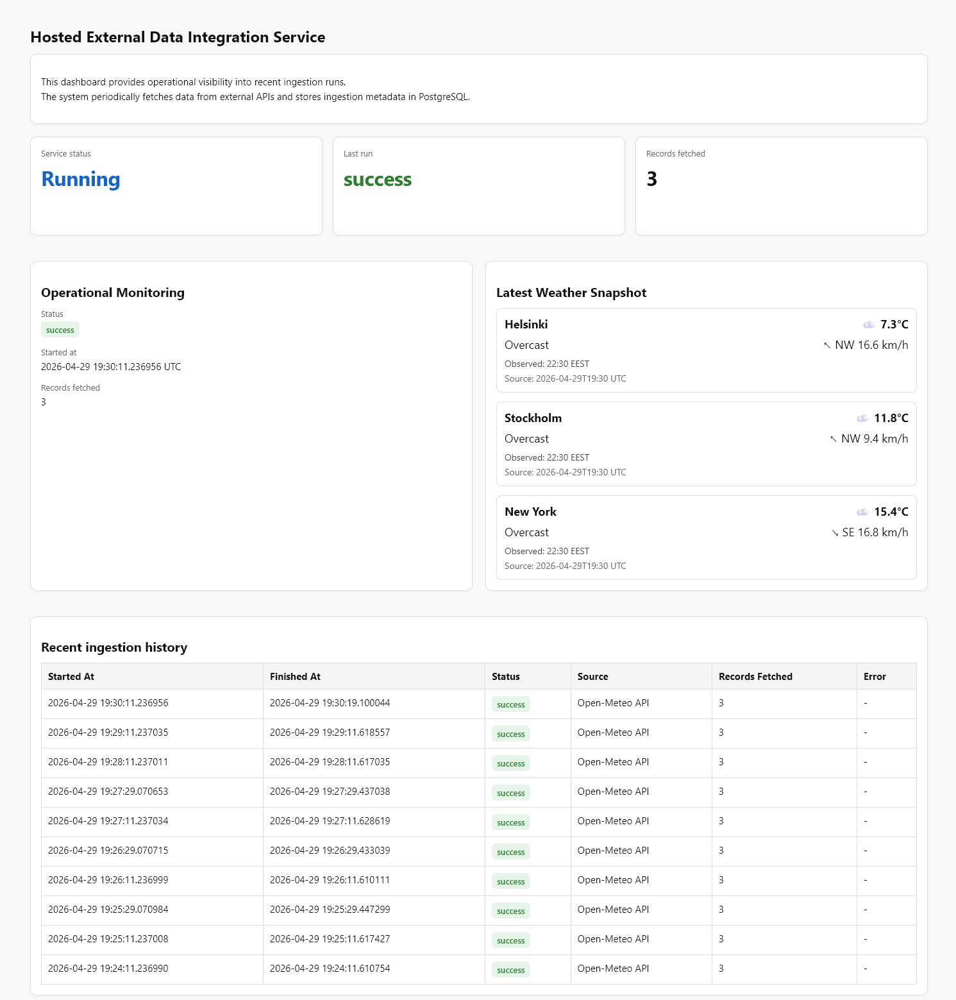
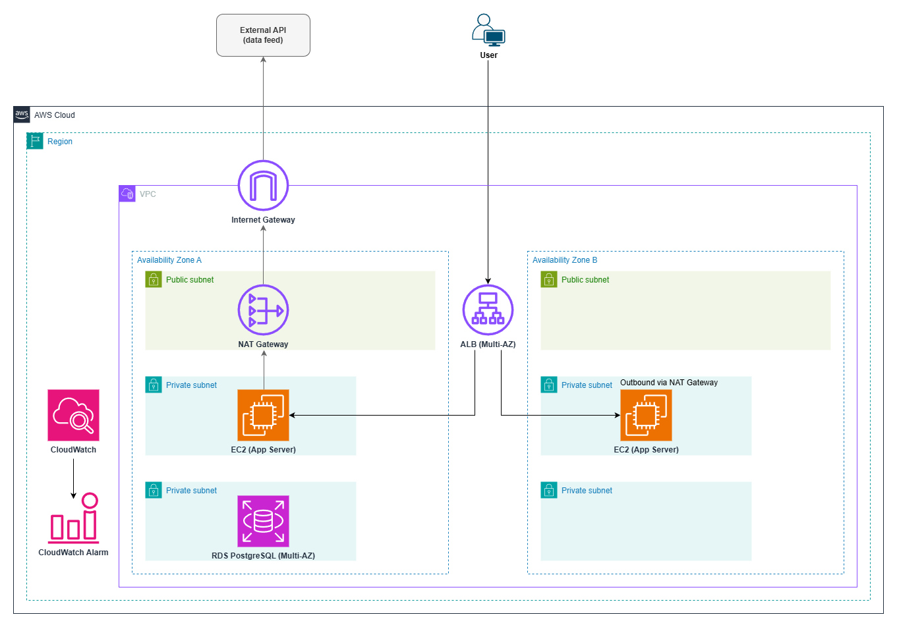
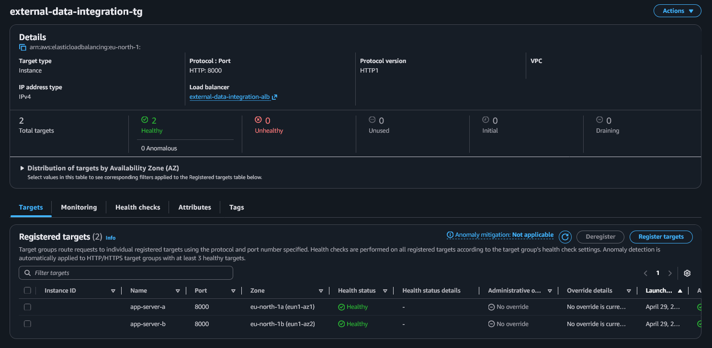
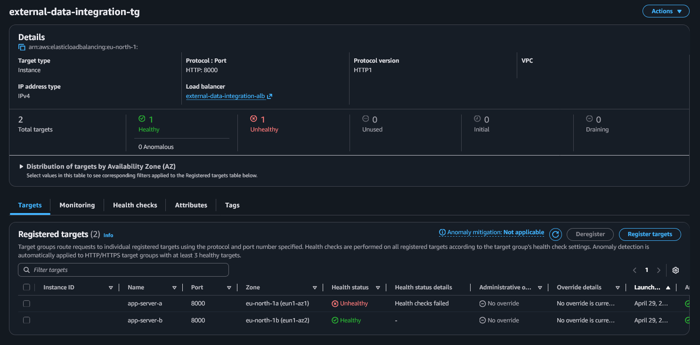

# Hosted External Data Integration Service (AWS)

### Status: Production-style AWS service deployed and validated

- ALB routing to private EC2 instances working
- Multi-AZ failover tested
- Background ingestion operational
- External API integration working
- Data stored in RDS PostgreSQL
- CloudWatch monitoring and alarms validated

## Goal

Fetch → store → monitor → visualize external operational data in a production-style AWS environment.

This project implements a realistic cloud service pattern commonly used for:

- Third-party API integrations  
- Operational data ingestion  
- Scheduled background data collection  
- Internal dashboards and reporting services  

The focus is on **clean architecture, networking fundamentals, automation, and observability**, rather than building a full end-user product.

---

## Dashboard Overview

Production-style operational dashboard providing real-time visibility into system behavior:

- Current service status and latest ingestion result  
- Background ingestion activity and scheduling  
- Latest external data snapshot  
- Historical ingestion runs and trends  

Designed to simulate internal operational tooling used to monitor continuously running cloud services and diagnose failures.

---

## Architecture Overview

### Flow

1. User accesses the dashboard via HTTPS through the Application Load Balancer (ALB)  
2. ALB routes traffic to FastAPI application instances running on private EC2 instances  
3. A background scheduler within the application periodically fetches data from an external API via the NAT Gateway  
4. The application stores historical data in Amazon RDS PostgreSQL  
5. Amazon CloudWatch collects logs and operational metrics  
6. CloudWatch alarms notify on unhealthy backend targets and resource thresholds (e.g. CPU usage)  

In this project, a public API (such as weather data) is used only to simulate a continuous external data stream.  
The data itself is not the focus of the system.

The purpose is to demonstrate a realistic external API integration pattern, where a service periodically ingests data from third-party providers, stores historical records, and provides operational visibility.

This architecture can be applied to:

- Partner integrations  
- Price monitoring  
- Operational metrics collection  
- IoT data ingestion  
- Analytics pipelines  
- Business reporting systems  

---

## Problem Statement

Design and implement a continuously running service that securely ingests external third-party data, stores historical records, and exposes that data through a dashboard — without placing the application server directly on the public internet.

This reflects real-world systems where:

- External APIs must be polled periodically  
- Services must run continuously  
- Application servers should not be publicly exposed  
- Data must be stored and queried over time  
- Operational visibility is required for monitoring and debugging  

---

## First Principles Breakdown

### What is the simplest system that satisfies the requirements?

A minimal viable architecture must include:

1. **Secure public entry point**  
An HTTPS endpoint for accessing the service.

2. **Always-on compute**  
Continuous runtime to serve the dashboard and perform background ingestion.

3. **Controlled outbound internet access**  
Ability to securely call external APIs from a private environment.

4. **Persistent storage**  
A database for storing and querying historical data.

5. **Operational visibility**  
Logging and monitoring to observe system behavior and detect failures.

---

## Business Context

Many systems need to periodically collect data from external providers:

- Weather APIs  
- Partner systems  
- Pricing feeds  
- Traffic data  
- Monitoring endpoints  
- Analytics services  

These systems typically require:

- Scheduled ingestion  
- Persistent storage  
- Internal dashboard  
- Controlled networking  
- Observability  

This project implements a **hosted external data integration service** designed to handle these requirements in a controlled, production-style AWS environment.

---

## Cost and Scaling Model

- Always-on EC2 compute (chosen instead of serverless to model continuously running integration services)  
- Predictable baseline cost  
- Suitable for continuous ingestion services  
- Scales vertically and can be extended to handle higher load with additional instances
- Can be extended with Auto Scaling for dynamic capacity management 

This architecture trades **higher baseline cost** for **more realistic hosted service design**.

---

## Design Decisions & Trade-offs

### Application Load Balancer instead of public EC2

Pros:
- Application server not exposed to the internet  
- Built-in load balancing and health checks  
- Ready for multi-AZ deployment  

Trade-off:
- Adds infrastructure complexity and cost compared to a single public instance  

---

### Private EC2 instances

Pros:
- No public IP exposure  
- Controlled inbound access via ALB  
- More secure architecture  

Trade-off:
- Requires additional components (NAT Gateway) for outbound internet access  

---

### NAT Gateway for outbound API access

Pros:
- Enables secure outbound internet access from private subnets  
- Keeps application layer fully private  

Trade-off:
- Adds recurring cost and becomes a single point of egress  

---

### RDS PostgreSQL for storage

Pros:
- Structured relational data model  
- Supports historical data and queries  
- Realistic production backend  

Trade-off:
- Higher operational complexity compared to simpler storage solutions  

---

### Multi-AZ network design

Pros:
- Infrastructure distributed across multiple Availability Zones  
- Enables higher resilience and failure isolation  

Trade-off:
- Increased cost and architectural complexity compared to a single-AZ setup, while full elasticity (e.g. Auto Scaling) was intentionally not implemented

---

## Infrastructure as Code

All infrastructure is defined using **Terraform**.

Provisioned infrastructure:

- VPC  
- Public subnets (multi-AZ)  
- Private application subnets (multi-AZ)  
- Internet Gateway  
- NAT Gateway  
- Route tables  
- Application Load Balancer  
- EC2 application instances (deployed across multiple Availability Zones)  
- Security groups  
- CloudWatch alarms  
- SNS email notifications  

Principles:

- Reproducible deployments  
- Least-privilege IAM  
- Clear network boundaries  
- CI/CD-driven infrastructure workflow  

Infrastructure deployments are managed via GitHub Actions using OIDC authentication, with approval-gated Terraform apply workflows.

---

## CI/CD & Infrastructure Automation

This project is designed to be deployed via GitHub Actions using Terraform.

Pipeline characteristics:

- Pull Request terraform plan  
- Validation before merge  
- Approval-gated apply  
- OIDC authentication  
- No static AWS credentials  
- Deterministic infrastructure  

This models a **production-style infrastructure workflow**.

---

## Security Characteristics

- Application server is private  
- Inbound traffic via ALB only  
- No public EC2 instance  
- Outbound access via NAT Gateway  
- Database in private subnet  
- Least privilege IAM roles  
- CI/CD authentication via OIDC  

---

## Proof of Deployment & Failure Testing

### 1. Normal operation
- ALB routing to private EC2 instances
- Target group healthy
- Dashboard accessible

### 2. Failure scenario: EC2 instance failure

One application instance was manually stopped to simulate infrastructure failure.

- ALB detected unhealthy target
- Traffic routed to remaining healthy instance
- Service remained available

### 3. Result

- No user-visible downtime observed
- ALB health checks successfully removed unhealthy target
- System continued serving traffic

This test validates the system’s ability to handle instance-level failures without user-visible downtime.

---

## Operational Visibility

The system includes production-style monitoring and observability:

- Structured application logs in CloudWatch  
- Background ingestion logging for scheduled jobs  
- Health endpoint for service status checks  
- CloudWatch alarms for infrastructure and application health  
- SNS email notifications for alerting  

This provides real-time visibility into system behavior and failure conditions.

---

## Scope and Design Decisions

This project intentionally focuses on core cloud engineering fundamentals:

- VPC networking and private infrastructure design  
- Application Load Balancer ingress and controlled traffic flow  
- Always-on compute architecture (EC2)  
- External API ingestion pattern  
- Persistent storage with RDS  
- Observability with CloudWatch and alerting  

To maintain focus and clarity, the following production features were intentionally excluded:

- Auto Scaling Group for dynamic capacity management   
- Advanced authentication and access control  
- Complex frontend or UI framework  
- Defined service-level targets (SLA/SLO)  
- Advanced alerting and tracing  

This reflects a deliberate engineering trade-off: prioritizing foundational architecture, networking, and observability over full production complexity.

The system was validated using multiple EC2 instances behind an Application Load Balancer, including instance failure testing to verify resilience.

---

## Engineering Commentary

This project demonstrates a production-style evolution from a simple network foundation to a monitored, multi-instance cloud service.

Development approach:

- Network foundation and secure ingress (VPC, ALB, private subnets)  
- Application deployment and database integration (EC2 + RDS)  
- Observability layer (CloudWatch logs, alarms, SNS notifications)  
- High availability validation through multi-AZ failover testing  

This iterative approach reflects how real-world systems are gradually evolved rather than built all at once.

---

## Project Summary

This project implements a **production-style hosted external data integration service** built inside an AWS VPC with controlled networking, persistent storage, and operational monitoring.